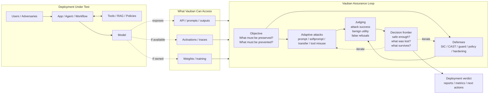

<!-- SPDX-FileCopyrightText: 2026 Teilo Millet -->
<!-- SPDX-License-Identifier: Apache-2.0 -->

# Vauban Overview

## Reading Guide

- `API` access enables prompt-level attack and evaluation.
- `Activations` enable measure, probe, scan, steering-style analysis, and deeper safety evidence.
- `Weights` enable full white-box work: cutting, export, fine-tuning, and the strongest adversarial loops.
- The center of Vauban is the same in all cases: define the objective, pressure it with adaptive attacks, defend it, and measure retained useful behavior.
